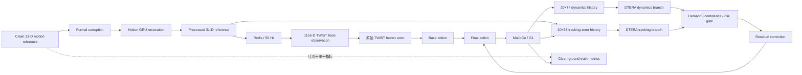
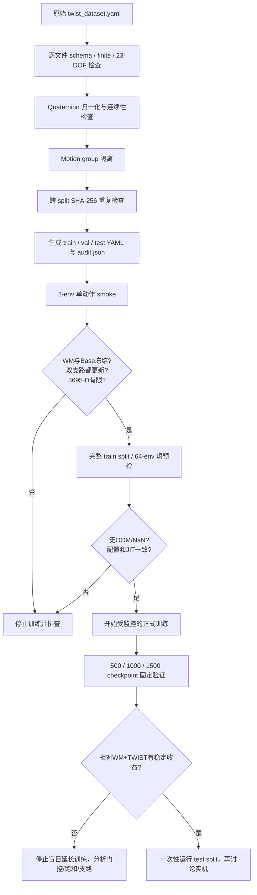

# TWIST-WM 项目周报

**周期：本周（按 4 个工作日整理）**  
**主题：Motion-WM + DTERA 闭环集成、仿真诊断与训练前可靠性检查**

## 一、本周目标与总体进展

本周围绕“Motion-WM 修复动作参考、DTERA 根据机器人状态进行动作残差修正”的闭环方案开展工作。主要完成了从高层参考处理、低层策略部署、成组仿真评估，到新训练任务和训练前数据审计的完整链路。

当前结论如下：

- Motion-WM、原始 TWIST 和 DTERA 已能够在同一条 50 Hz 仿真链路中稳定运行。
- clean ground truth 已与实际送入策略的 reference 分离，三组实验可以统一、公平地计算跟踪误差。
- 3695-D DTERA 双历史输入、24 帧 WM warmup、Redis/MuJoCo 状态重置及逐帧日志均已验证。
- 旧 DTERA checkpoint 在部分场景能够改善 corrupt reference 下的结果，但还没有稳定优于“Motion-WM + 原始 TWIST”；不能仅凭现有结果进入实机。
- 已完成新的 V2 门控方案、下肢专项奖励、曲线诊断和训练前全量审计。新的 DTERA 分支应从零训练，不接旧 4800 或 V2-1400 checkpoint。

整体技术链路如下：

## 二、分日工作内容

### 第 1 天：完成 Motion-WM 闭环演示与公平评价

主要工作：

1. 修复 `--motion_file` 和高层动作 reference 的加载/发布链路，建立基于原始 motion 数据的 50 Hz reference 流。
2. 在高层服务中同时发布：
   - 原始 clean reference；
   - corruption 后的 reference；
   - Motion-WM 修复后的 reference。
3. 修复评价口径：低层不再把“实际送入 TWIST 的 reference”当作 ground truth，而是统一使用额外发布的 clean reference 计算 joint/root tracking error。
4. 完成 clean、corrupt、corrupt+WM 三组 MuJoCo 闭环运行，输出视频、逐帧数据和 summary。
5. 建立 formal 与 demo_stress 两档污染，用相同 motion、seed、TWIST JIT 和初始状态进行配对比较。

阶段结果：

- formal 污染下，Motion-WM 将 Joint RMSE 从 0.15525 降至 0.14638，改善约 **5.72%**；Root error 从 0.34180 降至 0.28712，改善约 **16.0%**。
- demo_stress 下，Joint RMSE 从 0.17463 降至 0.16639，改善约 **4.72%**；但 root error 没有同步改善，说明强污染下仍存在模型能力边界。
- 视频和指标证明 Motion-WM 的参考修复是有效的，但部分改善用肉眼不容易稳定分辨，因此后续评价转向同步曲线和逐帧指标。

当日产出：高低层运行脚本、clean/corrupt/WM 视频、三组 summary、统一 clean ground-truth 指标逻辑。

### 第 2 天：接入 DTERA 双支路并完成 A–E 组合及消融

主要工作：

1. 将低层策略从普通 1155-D TWIST 切换为 DTERA JIT，并强制检查启动信息：
   ` [DTERA] Detected 3695-D dual-history policy `。
2. 核对并实现 DTERA 运行时输入：
   - 1155-D TWIST base observation；
   - 20×74 dynamics history；
   - 20×53 tracking-error history。
3. 确保 tracking-error history 使用 Motion-WM 修复后、真正送入策略的 reference；clean reference 仅用于评价。
4. 解决 WM 前 24 帧 warmup、DTERA 两类历史、Redis frame id 和 MuJoCo 初始状态的同步重置问题。
5. 完成五组主要对照：
   - A：corrupt + 原始 TWIST；
   - B：WM + 原始 TWIST；
   - C：corrupt + DTERA；
   - D：WM + DTERA；
   - E：clean + DTERA。
6. 完成 gate off、demand only、demand+confidence、full、dynamics only、tracking-error only 六类 DTERA 消融。
7. 每帧记录 clean/corrupt/WM reference、robot state、两支路修正、各类 gate 和 final action，并检查历史窗口移位、动作重构和分支抵消情况。

阶段结果：

- 共完成 55 次运行、19,130 个策略帧；全部运行使用相同初始 MuJoCo qpos，并完成逐帧同步校验。
- 单动作实验中，D 相对 C 的 Joint RMSE 改善 7.40%，相对 B 改善 0.50%，但 pitch、tilt 和部分 root velocity 指标变差。
- 三个固定动作、三个 seed 的聚合结果中，D 相对 C 改善 2.28%，8/9 组配对有效；但 D 相对 B 的 Joint RMSE 反而差 0.37%，仅 2/9 组更好。
- 两支路平均 cosine 约 0.397，只有约 6.2% 帧出现方向相反的修正，因此没有证据表明“持续互相抵消”是主要问题；更可能的问题是修正过保守、姿态过修正以及 heading 误差表达不足。

当日结论：Motion-WM + DTERA 架构已经打通，但旧 DTERA checkpoint 没有形成稳定净收益，不能只展示最好动作，也不能直接用旧 checkpoint 继续训练。

### 第 3 天：V2 门控、下肢专项训练任务与定量曲线诊断

主要工作：

1. 针对旧策略过于保守、双支路效果不明显的问题，增加 V2 训练配置：
   - dynamics 与 tracking 使用独立 gate；
   - tracking demand 改为 smoothstep；
   - dynamics/tracking branch gain 调整为 0.5/0.25；
   - joint 与 root-pose clean-reference 奖励从 0.6 提高到 0.8；
   - 原始 TWIST 和 Motion-WM 继续冻结。
2. 新增下肢专项任务 `g1_motion_wm_dtera_legs`：对左右髋、膝、踝共 12 个关节增加对称的 clean-reference position/velocity reward，并通过关节名称校验防止映射错误。
3. 新增仿真曲线工具和逐帧 trace，输出关节角/速度、root 姿态/速度、reference、final action、支路残差、gate、推理耗时等数据，减少依赖肉眼判断。
4. 对 V2-1400、原始 TWIST、不同 branch/gain 组合进行同步闭环诊断。
5. 补充高层、低层、训练和 JIT 导出命令到 `README-WM.md`。

诊断发现：

- `mydata3/24_seg00.pkl` 上，WM + TWIST 的 Joint RMSE 为 0.15910，WM + DTERA 为 0.15925，DTERA 增量收益接近于零。
- clean 策略的描述性关节延迟约 40 ms，WM 组约 60 ms；25 帧 GRU 窗口本身并不等价于固定 25 帧延迟。
- 24–32 秒区间存在明显 heading/yaw 漂移；当前 tracking history 中是 yaw-rate error，而非绝对 heading error，可能难以抑制长期偏航积累。
- 简单提高 global gain 或重新分配双支路增益没有解决问题，反而提高 max tilt，说明不能靠部署端无依据放大残差。
- 当前满 warmup 的 action residual 理论上限为 0.0225；乘 action scale 0.5 后，对关节目标的最大影响约 0.01125 rad（0.64°），确实属于偏保守的小修正范围。

当日结论：新训练应重点验证下肢幅度、root heading 和稳定性之间的平衡；旧 V2-1400 可以继续用于仿真诊断，但不应直接作为实机部署结论。

### 第 4 天：训练前全量审计、数据隔离与真实 GPU 预检

主要工作：

1. 排查并修复训练入口可能错误加载旧 `/home/hank/TWIST/pose` 的问题，使训练、导出和高层部署优先使用当前 checkout。
2. 修复 RSI 时序问题：机器人已经按随机 motion phase 初始化后，runner 不再只随机 episode counter，避免初始 reference 与机器人姿态错位。
3. 修复 motion 末尾回绕问题：RSI 从动作中段开始时，按剩余动作长度结束 episode，防止 reference 突然跳回第 0 帧。
4. 强化 MotionLib：
   - quaternion 归一化并保持符号连续，与离线 WM 预处理一致；
   - 检查 fps、帧数、23-DOF、body 顺序、NaN/Inf 和零 quaternion；
   - 加载失败默认直接报错，不再静默少训 motion；
   - 大型 local-body-position tensor 在 CPU 拼接后一次上传 GPU，降低显存峰值。
5. 对原始数据执行全量审计，并生成隔离后的 train/val/test YAML。
6. checkpoint 保存完整 policy/algorithm/runner 配置；JIT 导出时检查非 tensor 的 gate、gain、scale 和 warmup 配置，避免“权重相同、运行配置不同”。
7. 评估续跑增加 manifest 校验，禁止不同 checkpoint 或配置混入旧实验结果；评估脚本不再默认使用旧 4800 checkpoint。
8. 完成真实 GPU 短训练和 JIT 导出验证。

数据审计结果：

- 原始 YAML 共 15,303 条记录、15,302 个唯一 motion。
- 最终得到 train 12,248、val 1,519、test 1,455 个 motion。
- 发现 36 对跨 split 字节完全相同的数据，隔离涉及的 72 个 motion group。
- 发现 282 个 motion 的 quaternion norm 偏差超过 0.05，统一在加载阶段修复，不修改原始 PKL。
- 全部唯一文件通过结构和有限值检查，最终训练清单无结构错误。

GPU 预检结果：

- 单 motion、2 环境、3 次 PPO 更新：WM/base 权重保持冻结，两条 DTERA 分支和两个 history encoder 均发生更新，3695-D observation 和训练指标均为有限值。
- 完整 12,248-motion train split：2 环境和 64 环境短训练均成功，不再出现 MotionLib 拼接 OOM。
- 64 环境最后一次迭代约 2.69 s；PyTorch 峰值 allocated 约 3.02 GB、reserved 约 3.98 GB。该值不包含 PhysX 等非 PyTorch 显存。
- 新 smoke checkpoint 的 JIT 导出通过 strict load 和 eager/traced 数值一致性检查，最大误差为 0。

训练前检查流程如下：

## 三、本周主要成果

1. 打通 Motion-WM + DTERA 的完整训练、导出、Redis 部署和 MuJoCo 闭环。
2. 建立统一 clean ground truth 的公平评价方法，以及 A–E 主对照和六类 DTERA 消融。
3. 将“看视频”升级为逐帧可复现的指标、曲线、日志和配置哈希分析。
4. 明确旧 DTERA 的真实效果边界：能够改善 corrupt+DTERA，但尚未稳定优于 WM+TWIST。
5. 新增 V2 独立门控和下肢专项训练任务，为步幅缩短、下肢幅度不足和左右不对称问题提供训练入口。
6. 完成全量数据审计、泄漏隔离、时序修复、显存修复和训练/JIT 双重 smoke，为下一轮正式训练降低无效训练风险。

## 四、当前风险与未解决问题

- 当前 residual 上限较小，可能不足以修复明显的步幅和关节幅度误差；但直接在导出端放大会增加倾斜风险。
- demand-only 是当前主训练模式，confidence/risk 主要还是诊断信号，尚不能宣称 learned safety gate 已有效工作。
- heading 使用 yaw-rate error，长期 yaw 漂移问题尚未通过新训练解决。
- 下肢专项奖励能否改善落脚、步幅和稳定性仍需新 checkpoint 验证；当前只完成训练链路 smoke。
- 数据审计能排除 group 和字节相同副本泄漏，但不能识别所有语义近重复动作；原始 TWIST 预训练集来源不完整，也不能声称 test motion 对 TWIST 完全未见。
- 目前没有完成实机安全验证，V2-1400 不建议直接用于实机部署。

## 五、下周计划

1. 使用审计后的 `train.yaml` 从零训练 `g1_motion_wm_dtera_legs`，不加载旧 DTERA checkpoint。
2. 在 500、1000、1500 轮固定保存和评估；注意 1000 轮以前 residual 仍处于 warmup。
3. 使用预先固定的 val motions 和 seeds 42/43/44，运行 A/B/C/D/E 及 clean_base 对照，不根据单个动作选择参数。
4. 重点比较下肢 RMSE、髋膝幅度/步幅、root velocity、height、roll/pitch/yaw、max tilt、跌倒率、action rate、门控覆盖率、分支饱和率和推理耗时。
5. 若 D 在固定验证集上不能稳定优于 B（WM+原始 TWIST），停止盲目增加训练轮数，依据 residual 饱和、gate 分布、支路抵消率和 heading 漂移做单因素实验。
6. 只有验证集确认稳定收益后，才一次性运行 test split；通过仿真安全检查后再考虑实机。

## 六、相关材料

- 运行与训练命令：`README-WM.md`
- 训练前详细审计：`TRAINING-PREFLIGHT.md`
- DTERA 配对评估：`motion_wm_dtera_outputs/VALIDATION.md`
- V2 方案说明：`MOTION_WM_DTERA_V2.md`
- 下肢专项任务说明：`MOTION_WM_DTERA_LEGS.md`
- 数据审计：`legged_gym/motion_data_configs/wm_dtera_prepared_20260916_local/audit.json`
